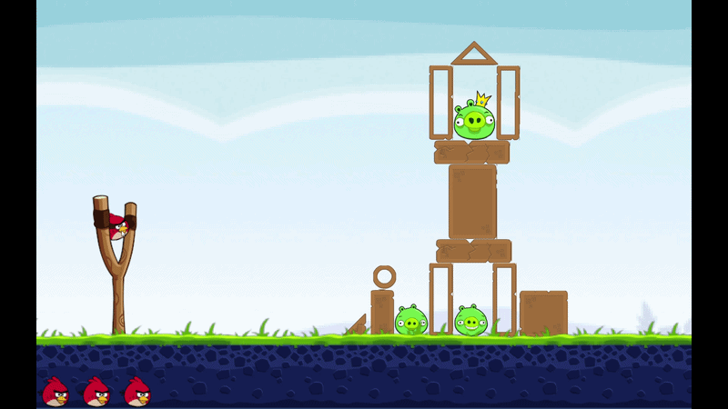

# Angry Birds 2D Clone — Unity 6

A fully functional 2D Angry Birds clone built with **Unity 6**, featuring **Google Authentication** and real-time global **Leaderboards** powered by **Unity Gaming Services (UGS)**.



---

## Project Overview
This project showcases core 2D game development practices, physical trajectory mechanics, and cloud backend integration. Designed with clean architecture, decoupled event-driven modules, and asynchronous programming in C#.

---

## Tech Stack
* **Game Engine:** Unity 6 (2D Physics & URP)
* **Language:** C# (.NET / Asynchronous Programming)
* **Backend Services:**
  * **Unity Gaming Services (UGS):** Authentication, Player Accounts, Leaderboard Service
  * **OAuth 2.0:** Google Auth Integration
* **Architecture & Patterns:**
  * **Singleton Pattern:** Global state management (`GameManager`, `ScoreManager`)
  * **Observer Pattern (C# Events):** Decoupled UI updates and authentication event handling
  * **Async / Await:** Non-blocking network requests for cloud services

---

## Key Features
* **2D Trajectory & Sling Physics:** Real-time trajectory prediction using `Rigidbody2D` and `SpringJoint2D`.
* **Google OAuth & UGS Auth:** Player sign-in flow with fallback profile setup.
* **Global Leaderboard:** Automatic high-score submissions upon winning and real-time top-rank fetching.
* **Score System:** Dynamic scoring algorithm calculated based on shot efficiency.

---
---

## Key Learnings & Personal Reflections
Building this project was a major milestone in my Unity development journey. Beyond implementing core game mechanics, it provided valuable hands-on experience with backend integration and clean C# architecture:
* **Cloud Integration & Security:** Connecting **Google OAuth** with **Unity Gaming Services (UGS)** taught me how to manage authentication flows, handle asynchronous backend operations with `async/await`, and keep sensitive credentials secure.
* **Architectural Decoupling:** Applying the **Observer Pattern** for UI and authentication events helped me keep components independent, making the codebase easier to scale and maintain.
* **Git Workflow Discipline:** Setting up standard `.gitignore` rules and preventing heavy build artifacts from polluting the repository reinforced professional version-control practices.

---

## Future Improvements & Roadmap
To further enhance the gameplay experience and technical depth, I plan to work on:
- [ ] **Special Bird Abilities:** Introduce new bird types with unique abilities (e.g., speed boost, explosive impact, splitting in mid-air).
- [ ] **Cloud Save Integration:** Sync player progression (unlocked levels and star ratings) across devices using UGS Cloud Save.
- [ ] **Game Juice & Polish:** Add dynamic particle effects, screen shake, and richer feedback on collisions to make interactions more satisfying.
- [ ] **Expanded Level Design:** Create multiple levels with varying obstacle layouts and difficulty curves.
## Getting Started

### Prerequisites
* **Unity Engine:** `6000.x` or higher
* Internet connection for UGS cloud authentication and leaderboard updates

### Installation
1. **Clone the repository:**
   ```bash
   git clone [https://github.com/dongtkn/AngryBird-Clone-UGS.git](https://github.com/dongtkn/AngryBird-Clone-UGS.git)
